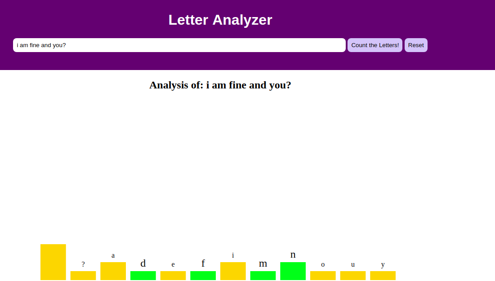

# Phrase

First phrase: gets a phrase and count the number of times a letter is in this phrase.
Second phrase: gets the second phrase and count the number of times a letter is in this phrase and change the colour in case this letter was in the first phase.

